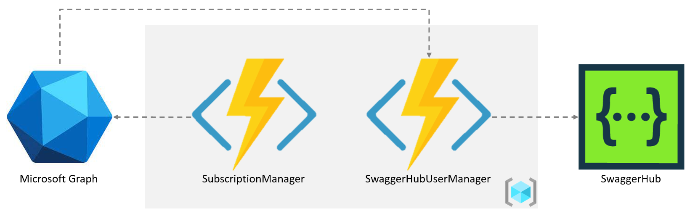

# AzureAD-SwaggerHub-UserManagement
This is a sample project to demonstrate methods of managing SwaggerHub users automatically based on Azure AD group memberships via Azure Functions, MS Graph, and the SwaggerHub User Management API.


Many organizations leverage Azure AD identity & access management for authentication and for controlling what resources/applications employees can access. If your organization uses Azure AD, then it's very likely that your preference (or perhaps even corporate policy) would be to manage SwaggerHub users in the same manner that you do with other applications and thus keeping the ownership close to your identity & access management functions, or perhaps your HR department.

This sample solution enables you to keep using your existing HR and/or application administration processes by having the administration of SwaggerHub users controlled through your Azure AD tenant. Users will get automatically provisioned or deprovisioned from SwaggerHub based on their assignment to Azure AD groups, thus negating the need to perform user management directly within SwaggerHub itself.

The benefits are:
- users on-boarded into your organization, will automatically get access to SwaggerHub assuming the appropriate Azure AD group membership is applied
- user leaving your organization are automatically removed from SwaggerHub once their group memberships are revoked
- users moving departments or teams within your organization, will have their SwaggerHub access modified based on the changes in Azure AD group assignments.

## Languages and services used
- [C#](https://docs.microsoft.com/en-us/dotnet/csharp/)
- [Azure Functions](https://docs.microsoft.com/en-us/azure/azure-functions/)
- [Microsoft Graph](https://docs.microsoft.com/en-us/graph/overview)
- [Azure AD](https://azure.microsoft.com/en-us/services/active-directory/#overview)
- [SwaggerHub](https://swagger.io/tools/swaggerhub/)
- [SwaggerHub User-Management API](https://app.swaggerhub.com/apis-docs/swagger-hub/user-management-api/v1)

## High Level Architecture



The sample solution consists of two Azure Functions which interact with the Microsoft Graph API and the SwaggerHub User-Management API.

**Components**
|Component|Description|
|---------|-----------|
|**SubscriptionManager** Azure Function| This `TimerTrgger` function runs daily and takes care of managing the *change notification subscription* with the Microsoft Graph. It will create a new subscription if one does not exists and otherwise will renew an existing subscription if its due to expire within 7 days|
|**AzureWebhookCallbackToManageSwaggerHubUsers** Azure Function| This `HttpTrigger` function is called by the Microsoft Graph anytime there is a *change* to group memberships within Azure AD. The function parses the recieved change notification and determines if it's interested in the notification (with the aid of the `GroupConfiguration.json` settings). If it's interested in the group, then it obtains additional information on the users added/removed from the group via the **Microsoft Graph** and in turn calls the **SwaggerHub User-Management API** to ensure the changes are reflected in SwaggerHub|

The following sequence diagram, explains the high level working of the solution:


## Azure Application and AD Group setup

It is assumed that you have an *Azure subscription* and that you setup an *Azure AD tenant*.

### Register Azure Application
Within your Azure subscription, you will need to register an application and assign it the necessary Microsoft Graph API permissions.

To register and application within the Azure portal, perform the following steps:

1. Login to the [Azure Portal](https://portal.azure.com)
2. Search for **App Registrations** using the global search bar (or via *Menu > All services > App Registrations*)
3. Click **New Registration**
4. Set a **Name** for your application e.g. `MSGraph Notifications for SwaggerHub`
5. Depending on your multi-tenancy requirements, choose the **supported account types**. If unsure, then I recommend choosing the `Accounts in this organizational directory only` option
6. Set a **Redirect URI** e.g. http://localhost
7. Click **Register**

Take note of your **Application (client) ID** and **Directory (tenant) ID** from the application overview section as you'll need them later

### Set up client secret
You will need to setup a client secret in order to be able to obtain an OAuth 2.0 access token which is required for invoking the MS Graph API.

1. Navigate to the **Certificates & secrets** menu option, beneath the *Manage* section of the left-hand navigation menu
2. Click **New client secret**
3. Set a **Description** for your secret and choose the appropriate **Expires** option (the shorter the better)
4. Client **Add**
5. Take note of the secret **value** as you will need it. Once you leave this view you will not longer be able to retrieve the secret.

### Grant Permissions on Microsoft Graph
You want this application to receive *change notifications* from the Microsoft Graph when the *Groups* resource changes and subsequently to be able to retrieve information on the *users* who where added/removed from a group. Thus the following permissions are required:
- `Group.Read.All` - Read all groups
- `User.Read.All` - Read all users' full profiles

To add the permissions to your registered app, perform the following steps:
1. Navigate tot he **API permissions** menu option, beneath the *Manage* section of the left-hand navigation menu
2. Click **Add a permission**
3. Choose **Microsoft Graph** from the *Microsoft APIs > Commonly used Microsoft APIs* section
4. Choose **Application permissions** as your application will be invoking these APIs using the *client_credentials* flow and *not* on-behalf of a user
5. Under the *Group* permissions, select **Group.Read.All**
6. Under the *User* permissions, select **User.Read.All**
7. Click **Add permissions**
8. Click **Grant admin consent for <YOUR TENANT>** and click **Yes** on the *Grant admin consent confirmation* dialog

### Azure AD Group Structures

The whole idea is that granting or revoking certain group memberships within Azure AD should either add, update, or remove users from SwaggerHub. For this to work, you need to configure the representative groups within your Azure AD tenant.

Depending on the number of SwaggerHub organizations you have the AD Group creation strategy will change. This solution supports single and multi-organization setups.

**Single SwaggerHub Organization**

If you have a single SwaggerHub organization, then the recommended group setup would be to create an AD Group per SwaggerHub role

|SwaggerHub Organization|SwaggerHub Role| AD Group Name (*example only - follow your own naming conventions*) |Description|
|-----------------------|---------------|----------------------|-----------|
|Org 1| CONSUMER | ADG-SWAGGERHUB-CONSUMERS | AD Group for consumers that will get access to SwaggerHub |
|Org 1| DESIGNERS | ADG-SWAGGERHUB-DESIGNERS | AD Group for designers that will get access to SwaggerHub |
|Org 1| OWNERS | ADG-SWAGGERHUB-OWNERS | AD Group for owners that will get access to SwaggerHub |

**Multiple SwaggerHub Organization**

Should you have multiple organizations within SwaggerHub, then you have flexibility with regards to how you want to structure your organizational groups.
You are free to linearly extend the examples above and be very explicit about setting up your groups per organizations - thus I would recommend including the SwaggerHub organization
name in the Azure AD Group name (e.g. **ADG-SwaggerHub-<`ORG NAME`>-<`ROLE NAME`>**).

Assuming you have two organizations, that would result in 6 AD groups:
|SwaggerHub Organization|SwaggerHub Role| AD Group Name (*example only - follow your own naming conventions*) |Description|
|-----------------------|---------------|----------------------|-----------|
|Org 1| CONSUMER | ADG-SWAGGERHUB-ORG1-CONSUMERS | AD Group for consumers that will get access to SwaggerHub |
|Org 1| DESIGNERS | ADG-SWAGGERHUB-ORG1-DESIGNERS | AD Group for designers that will get access to SwaggerHub |
|Org 1| OWNERS | ADG-SWAGGERHUB-ORG1-OWNERS | AD Group for owners that will get access to SwaggerHub |
|Org 2| CONSUMER | ADG-SWAGGERHUB-ORG2-CONSUMERS | AD Group for consumers that will get access to SwaggerHub |
|Org 2| DESIGNERS | ADG-SWAGGERHUB-ORG2-DESIGNERS | AD Group for designers that will get access to SwaggerHub |
|Org 2| OWNERS | ADG-SWAGGERHUB-ORG2-OWNERS | AD Group for owners that will get access to SwaggerHub |

The above will work for all scenarios, but perhaps is a little two verbose and results in you having many AD groups to manage.
Alternatively, you can define your own group structures based on your organizational domains and map to the existing SwaggerHub Orgs.

**Hypothetical example** - let's assume you have the following SwaggerHub organizations:
- Common Components Org - stores reusable common components
- Credit & Risk Org - stores APIs and components related to credit assessments, Customer Due Diligence, AML etc.
- Customer Management - stores APIs and components related to customers

You decide some governance rules like:
- Everyone can *read* the common components
- A core group will be owners across all orgs
- A core group will design and manage the common components
- *Customer Management* will have dedicated *designer* group
- *Credit & Risk* designers will also need to be *consumers* of *customer management*

This could lead you to the following group creation in Azure AD
| AD Group Name|Description|SwaggerHub Organization / Role assignement|
|--------------|-----------|------------------------------------------|
|ADG-SwaggerHub-Owners|AD Group for owners that will get access to SwaggerHub|AD Group for owners that will get access to all organizations SwaggerHub with `OWNER` role|
|ADG-SwaggerHub-Core-Designers|AD Group for core designers that will get access to SwaggerHub *Common Components Org*|`DESIGNERS` in *Common Components* org
|ADG-SwaggerHub-Customer-Mgmt-Designers|AD Group for designers of the Customer Mgmt org| `DESIGNERS` in Customer Mgmt and `CONSUMERS` in *Common Components* ord|
|ADG-SwaggerHub-Credit-Risk-Designers|AD Group for designers of the Credit & Risk Org| `DESIGNERS` in Credit & Risk and `CONSUMERS` in both *Common Components* and *Customer Mgmt* orgs|

Have your Azure AD administrator setup the appropriate AD groups.

## Configuration

Once you have finalized your Azure AD Group setup based on your SwaggerHub organizations, you need to update the `src/GroupConfiguration.json` file to reflect the setup. This file is used by the `AzureWebhookCallbackToManageSwaggerHubUsers` Azure function to:
- determine if list of AzureAD groups that is reacts to when a *notification* is received from MS Graph
- determine what SwaggerHub *organization* and *role* combination to use when creating or modifying a user in SwaggerHub

A sample configuration file of a simplistic three group, single organization setup is as follows:
```
{
    "GroupConfiguration": {
        "activeDirectoryGroups": [
            {
                "objectId": "bc9ae6d5-1ccf-45dd-b56f-9ca020348802",
                "name": "ADG-SWAGGERHUB-DESIGNERS",
                "swaggerHubRole": "DESIGNER",
                "organizations": [
                    {
                        "name": "frank-kilcommins"
                    }
                ]
            },
            {
                "objectId": "afd8b023-331d-4fc4-84f7-f5a4654cbbbd",
                "name": "ADG-SWAGGERHUB-CONSUMERS",
                "swaggerHubRole": "CONSUMER",
                "organizations": [
                    {
                        "name": "frank-kilcommins"
                    }
                ]
            },
            {
                "objectId": "126f28b7-a2b6-4a87-af23-edb61af80317",
                "name": "ADG-SWAGGERHUB-OWNERS",
                "swaggerHubRole": "CONSUMER",
                "organizations": [
                    {
                        "name": "frank-kilcommins"
                    }
                ]               
            }            
        ]
    }
}
```

### `ActiveDirectoryGroup` Object Details
The main object that is configured is the `activeDirectoryGroup` object which stores the mapping details allowing the solution to manage
SwaggerHub organization(s) based on a particular Azure AD Group. 

|Property|Property (nested)|Required|Description|
|-------|---|------|-----------|
|`objectId`||yes|The `objectId` of the AD Group as autogenerated by the tenant|
|`name`||no|The name of the AD Group as set within the tenant|
|`swaggerHubRole`||yes|The role that will be set in SwaggerHub for users receiving membership to the AD Group referenced by the `objectId`. Allowed options are `CONSUMER`, `DESIGNER` or `OWNER`|
|`organizations`||yes|The SwaggerHub organizations mapped or linked to the AD Group referenced by the `objectId`|
||`name`|yes|The **name** of the organization as created within SwaggerHub|


### Azure Function Settings
 *** ToDo ***

## Deploy to your Azure Subscription

You can quickly deploy this solution to your Azure subscription, using the options below.

**Option 1 - Azure Deploy Button** 

Click the button below to deploy the required infrastructure to your Azure subscription. **Note** you will still need to publish the code manually (you can follow the _Setting up locally_ section and deploy to your Azure environment).

<a href="https://portal.azure.com/#create/Microsoft.Template/uri/https%3A%2F%2Fraw.githubusercontent.com%2Ffrankkilcommins%2FAzureAD-SwaggerHub-UserManagement%2Fmain%2Fazuredeploy.json"
   target="_blank">
   
</a>

**Option 2 - GitHub Action**

You can fork this source code to your own repo and create the following GitHub action

```
on: [workflow_dispatch]     # change the triggering mechanism to suit your needs (manual run by default)

name: AzureAD-SwaggerHub-UserManagement-Setup-and-Deploy

env:
  AZURE_FUNCTIONAPP_PACKAGE_PATH: 'src'   # set this to the path to your web app project, defaults to the repository root
  DOTNET_VERSION: '5.0.402'               # set this to the dotnet version to use

jobs:

  # use ARM templates to set up the Azure Infra
  deploy-infrastructure:
    runs-on: ubuntu-latest

    # set outputs needed by subsequent jobs
    outputs:
      azFunctionAppName: ${{ steps.armdeploy.outputs.functionAppName }}
    
    steps:

    # check out code
    - uses: actions/checkout@main

    # login to Azure
    - uses: azure/login@v1
      with:
        creds: ${{ secrets.AzureAD_SwaggerHub_CREDENTIALS }}

    # deploy ARM template to setup azure resources (group & sub defined in credentials)
    - name: Run ARM deploy
      id: armdeploy
      uses: azure/arm-deploy@v1
      with:
        subscriptionId: ${{ secrets.AZURE_SUBSCRIPTION }}
        resourceGroupName: ${{ secrets.AZURE_RG }}
        template: ./azuredeploy.json
        parameters: ./azuredeploy.parameters.json
  

  # build and deploy our Azure functions for SwaggerHub + Azure AD user mgmt
  build-and-deploy:
    needs: [deploy-infrastructure]
    runs-on: windows-latest
    environment: prd
    steps:
    # check out code
    - name: 'Checkout code'
      uses: actions/checkout@main

    # login to Azure
    - uses: azure/login@v1
      with:
        creds: ${{ secrets.AzureAD_SwaggerHub_CREDENTIALS }}
        enable-AzPSSession: true      

    # get publish profile
    - name: Get publish profile
      id: fncapp
      uses: azure/powershell@v1
      with:
        inlineScript: |
          az account show
          $profile = ""
          $profile = Get-AzWebAppPublishingProfile -ResourceGroupName ${{ secrets.AZURE_RG }} -Name ${{ needs.deploy-infrastructure.outputs.azFunctionAppName }}
          $profile = $profile.Replace("`r", "").Replace("`n", "")
          Write-Output "::set-output name=profile::$profile"
        azPSVersion: "latest"

    # setup donet environments
    - name: Setup DotNet Environments
      uses: actions/setup-dotnet@v1
      with:
        dotnet-version: |
          3.1.x
          ${{ env.DOTNET_VERSION }}

    # build project
    - name: 'Resolve dependencies and build'
      shell: pwsh
      run: |
        pushd './${{ env.AZURE_FUNCTIONAPP_PACKAGE_PATH }}'
        dotnet restore
        dotnet build --configuration Release --output ./output
        popd

    # publish azure function
    - name: 'Run Azure Functions Action'
      uses: Azure/functions-action@v1
      id: fa
      with:
        app-name: ${{ needs.deploy-infrastructure.outputs.azFunctionAppName }}
        package: '${{ env.AZURE_FUNCTIONAPP_PACKAGE_PATH }}/output'
        publish-profile: ${{ steps.fncapp.outputs.profile }}
```

The GitHub action above, needs the following secrets configured:

- `Azure_SUBSCRIPTION` - your Azure subscription Id
- `Azure_RG` - the name of the Azure Resource Group that you want to deploy this solution into
- `AZUREAD_SWAGGERHUB_CREDENTIALS` - containing the credentials for a Service Principal with contributor access for the resource group. See how to get the [Service Principal credentials](https://docs.microsoft.com/en-us/azure-stack/user/ci-cd-github-action-login-cli?view=azs-2108).

## Setting up locally

### Prerequisites
- VSCode, Visual Studio or other IDE capable of running .NET 5 projects
- .NET 5
- Azurite - An open source Azure Storage API compatible server
- ngrok

The project was created using VSCode with the following extensions installed:
- [C#](https://marketplace.visualstudio.com/items?itemName=ms-dotnettools.csharp)
- [Azure Functions](https://marketplace.visualstudio.com/items?itemName=ms-azuretools.vscode-azurefunctions)
- [Azurite](https://marketplace.visualstudio.com/items?itemName=Azurite.azurite)

Install the following packages:
```
dotnet add package Microsoft.Identity.Client
dotnet add package Microsoft.Graph
dotnet add package NJsonSchema
```

Ensure that your development certs are trusted (required for debugging)
```
dotnet dev-certs  https --trust
```
### Running locally

Clone the repo and ensure the project builds
```
dotnet build
```
Setup your `local.settings.json` file. Here is a sample settings configuration:
```
{
  "IsEncrypted": false,
  "Values": {
    "AzureWebJobsStorage": "UseDevelopmentStorage=true",
    "FUNCTIONS_WORKER_RUNTIME": "dotnet-isolated",
    "TenantId": "INSERT YOUR AZURE AD TENANT ID",
    "AppId": "INSERT YOUR APPLICATION (CLIENT) ID",
    "AppSecret": "INSERT YOUR APPLICATION SECRET", //Recommendation - put this in Azure Key Vault and read from there
    "AppRedirectUrl": "INSERT REDIRECT URI OF YOUR REGISTERED APPLICATION e.g. http://localhost",
    "NotificationClientState": "A SECRET VALUE EXCHANGED BETWEEN YOUR APP AND MS GRAPH WHICH IS PASSED IN EACH NOTIFICATION",
    "NotificationSubscriptionResource": "groups",
    "NotificationSubscriptionChangeType": "updated,deleted",
    "NotificationFunctionEndpoint":"NGROK HTTPS ENDPOINT + api/AzureWebhookCallbackToManageSwaggerHubUsers",
    "SubscriptionLifeTimeInDays": "21",
    "SwaggerHubBaseUrl": "https://api.swaggerhub.com/",
    "SwaggerHubUserManagementApiVersion": "v1",
    "SwaggerHubUserManagementApiPath": "user-management",
    "SwaggerHubApiKey": "INSERT YOUR SWAGGERHUB API kEY" //Recommendation - put this in Azure Key Vault and read from there
  }
}
```
Setup your `GroupConfiguration.json` file (see *Configuration* section above for details on the *GroupConfiguration* setup)

Start `ngrok` on port 7071
```
ngrok http 7071
```

Copy the `https` forwarding address and use it to construct the `NotificationFunctionEndpoint` value in your `local.settings.json` file. 
For example, the ngrok session below results in a `NotificationFunctionEndpoint` value of `https://4a1b-86-41-165-62.ngrok.io/api/AzureWebhookCallbackToManageSwaggerHubUsers`


Start `Azurite` via command palette 
```
azurite: start
```

Now you can run the solution! :slightly_smiling_face:

### Setting up change notification subscription
In order to receive change notifications from MS Graph, you need to create a subscription via `https://graph.microsoft.com/v1.0/subscriptions`. 
You can do this by either sending a manual request to the endpoint or by triggering the `SubscriptionManager` function contained within this solution.

*Note for both options below, you need to ensure that your project is running, as the MS Graph will call back immeadiately to the `AzureWebhookCallbackToManageSwaggerHubUsers` function to validate connectivity prior to subscription creation.

**Option 1 - Create subscription manually**

Send a `POST` request to `https://graph.microsoft.com/v1.0/subscriptions`. Here is a sample `cURL` request:

```
curl --location --request POST 'https://graph.microsoft.com/v1.0/subscriptions' \
--header 'Content-Type: application/json' \
--header 'Authorization: Bearer <YOUR BEARER TOKEN GOES HERE!!>' \
--data-raw '{
  "changeType": "updated,deleted",
  "notificationUrl": "https://4a1b-86-41-165-62.ngrok.io/api/AzureWebhookCallbackToManageSwaggerHubUsers",
  "resource": "groups",
  "expirationDateTime": "2021-11-28T22:19:41.561Z",
  "clientState": "*somethingKnownBySubandWebhook*"
}'
```

**Option 2 - Manually run the Subscription Manager function**

By default, the subscription manager function is scheduled to run daily at noon based on it's `CRON` expression of `0 0 12 * * *`. Either adjust the CRON expression to run more frequently or you can trigger the function to run manually by making a call to the admin endpoint of the running function.

```
curl --location --request POST 'http://localhost:7071/admin/functions/SubscriptionManager' \
--header 'Content-Type: application/json' \
--data-raw '{ "input": "test" }'
```
